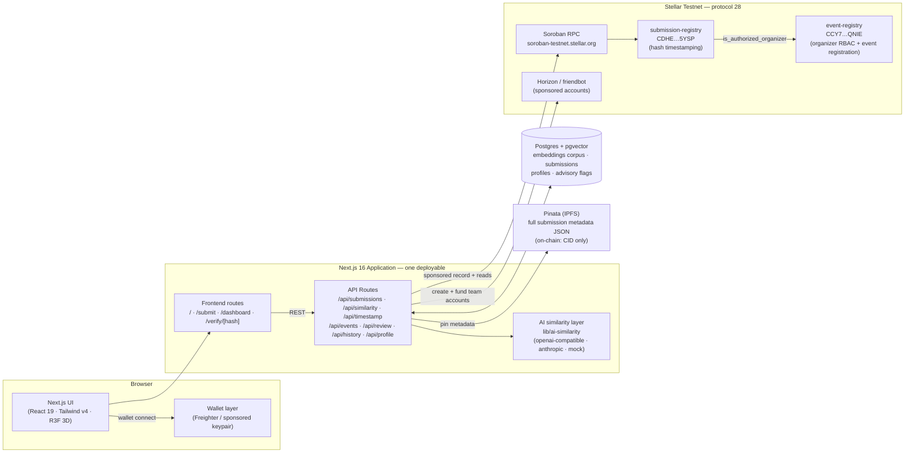
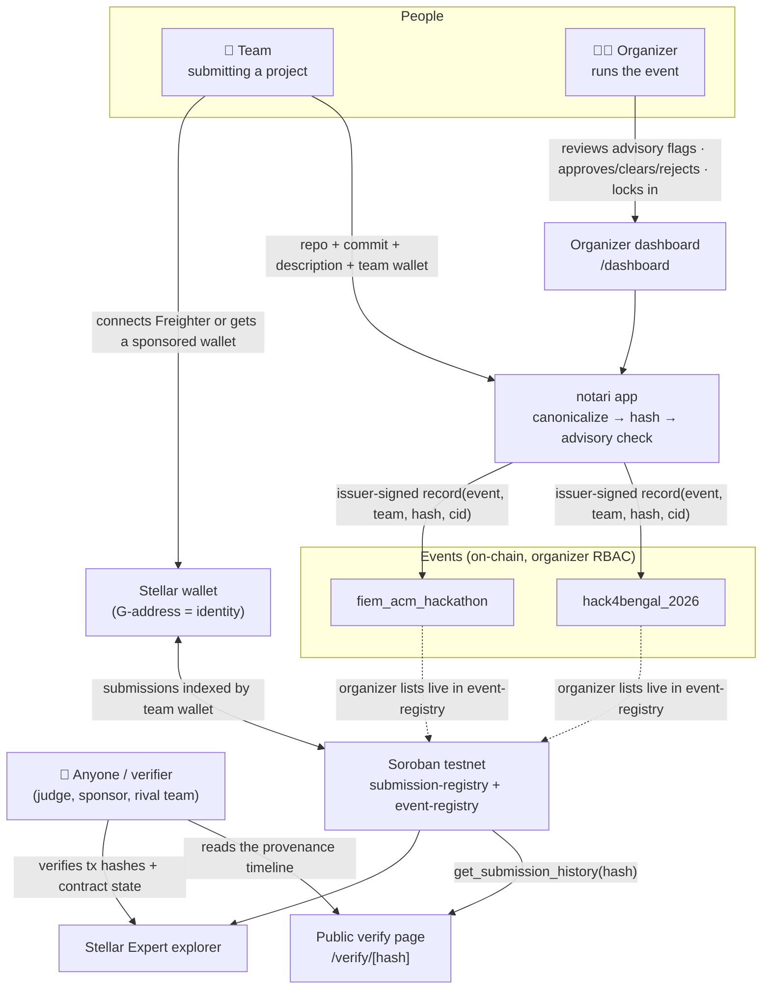
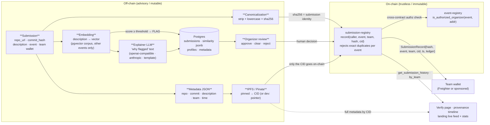
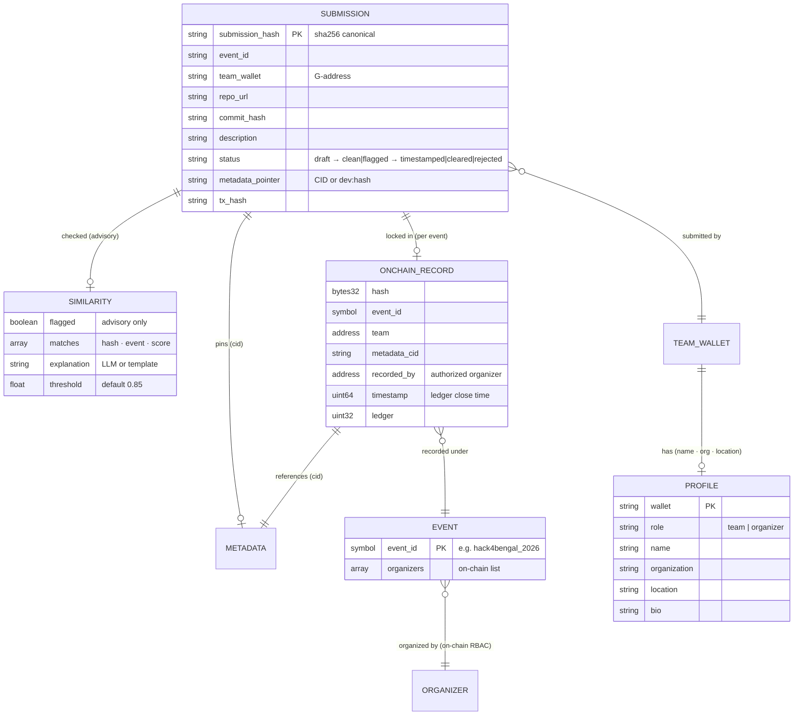
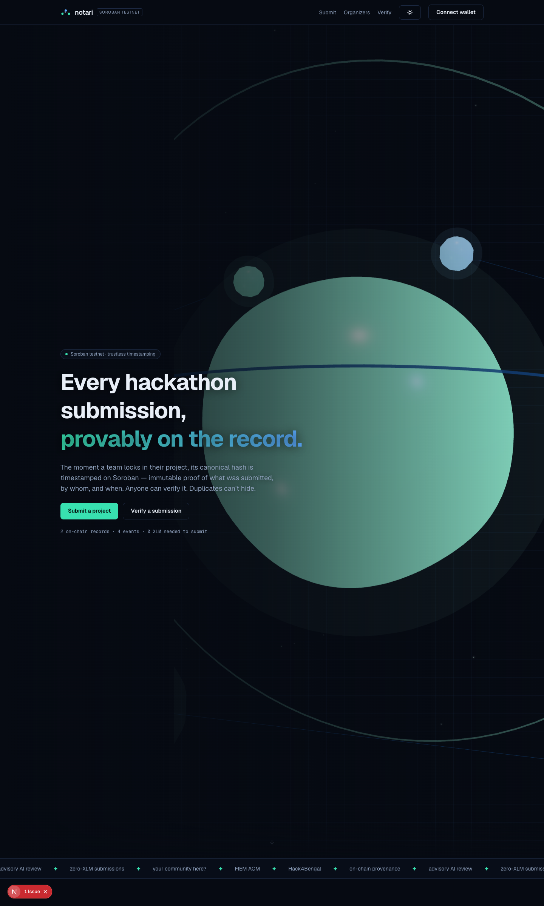
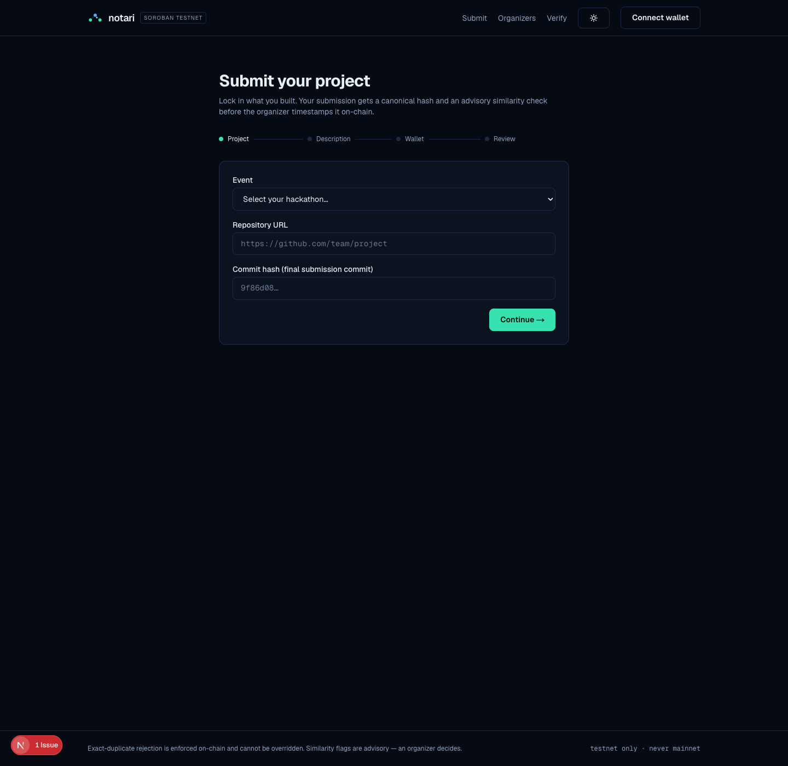
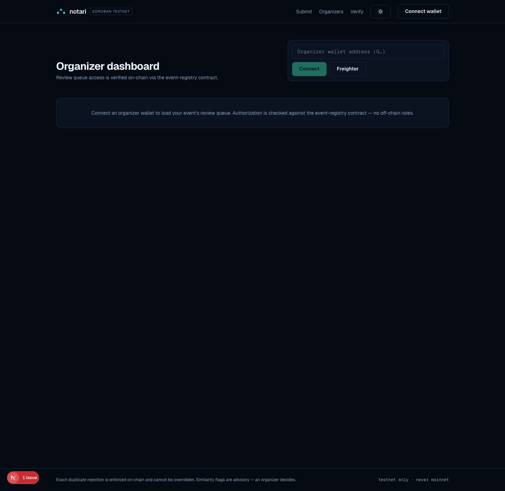
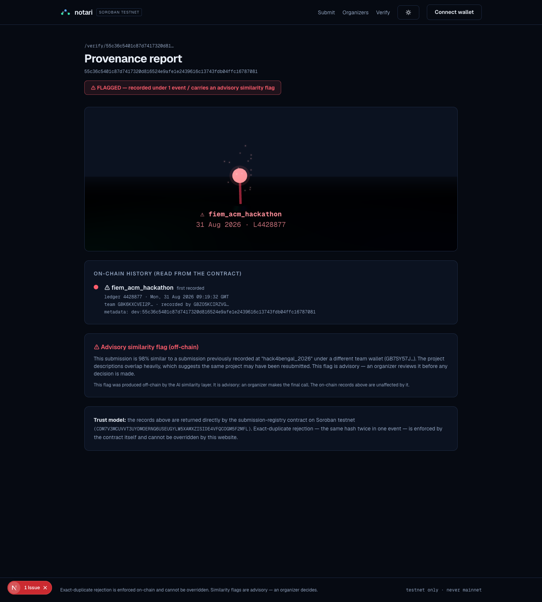
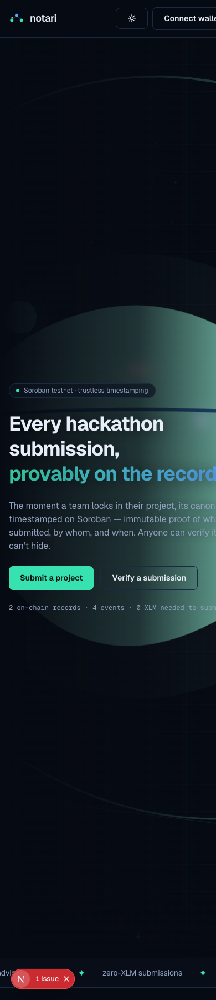
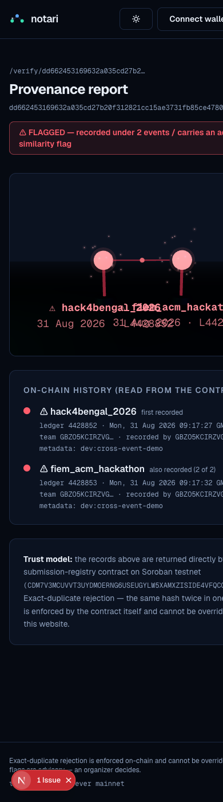

# notari — SubmitChain


> **"What was submitted, by whom, and when — proven on-chain. Verifiable by anyone."**

notari gives hackathons an **immutable, publicly verifiable record of every submission** on Stellar's **Soroban** smart-contract platform. The moment a team locks in their project, its canonical hash is timestamped on-chain; exact duplicates are rejected by the contract itself, and an advisory AI layer flags likely cross-event resubmissions for organizer review **before judging happens**. Anyone can open a submission's verify page and read its full provenance straight from the contract.

🌐 **Live Demo**: [tessera-beta-five.vercel.app](https://tessera-beta-five.vercel.app/)
📹 **Demo Video**: [Watch on YouTube](https://youtu.be/ZX6fF-mZ9bM)
📁 **Public GitHub Repo**: [github.com/amisayhan88/notari](https://github.com/amisayhan88/notari)

**Pilot communities:** FIEM ACM · Hack4Bengal

> **notari** — from *notarize*: to certify a record so no one can later deny it.
>
> **Target: Soroban testnet (protocol 28). Mainnet is never touched by this codebase.**

---

## 🏗️ Architecture



- **Contracts hold only what must be trustlessly enforced** — organizer authorization per event, and the exact-duplicate rejection (same canonical hash twice in one event panics). The chain stores the hash + a metadata pointer; full submission content lives off-chain.
- **The AI similarity layer is ADVISORY** — embeddings + pgvector cosine search + an LLM explanation. It flags; it never rejects. A human organizer always decides.
- **Orchestration lives in the API routes** — canonical hashing, IPFS pinning, sponsored transactions (the issuer pays every fee, so teams never need XLM), and on-chain-gated RBAC for the dashboard.
- **Wallet layer** — Freighter for teams/organizers who have a wallet, or a sponsored auto-generated testnet account for those who don't. The wallet address *is* the identity; profiles (name, org, location) are attached via `/api/profile`.

### User & actor diagram



### Data flow diagram



### Entity–relationship diagram



> **Trust split:** `SUBMISSION`, `SIMILARITY`, `METADATA` live off-chain (mutable, human-readable, advisory). `ONCHAIN_RECORD` and `EVENT`/`ORGANIZER` live on-chain (immutable, trustless). The only bridge is the **CID/pointer** — the on-chain record stays tiny while the submission content stays rich.

### The submission lifecycle

1. **Submitted** — a team fills the multi-step portal (event, repo, commit, description, wallet) → `POST /api/submissions`. The server canonicalizes (commit + stripped description + wallet) and stores the sha256 as the submission's identity.
2. **Advisory similarity check** — `POST /api/similarity` embeds the description, searches the pgvector corpus scoped to *other* events (same-event iteration never flags), and returns matches + an explanation above the threshold (default 0.85). The team sees the result immediately — no surprises at judging.
3. **Organizer review** — flagged rows land in the dashboard color-coded by score. The organizer approves lock-in, dismisses the flag, or rejects. **Nothing auto-rejects on similarity.**
4. **Timestamped on-chain** — `POST /api/timestamp` pins the metadata to IPFS, then calls `submission-registry.record()` in a **sponsored transaction** (the issuer signs and pays; teams need no XLM). If the hash already exists for that event, the contract rejects it — trustlessly.
5. **Verified** — the submission appears at `/verify/[hash]` with its on-chain provenance: every event it was recorded under, ledger timestamps, and the advisory flag history. Shareable forever.
6. **Duplicates can't hide** — a second identical submission in the same event panics in the contract (`Error(Contract, #4)`); the same hash *across* events is allowed on-chain and renders as a red multi-event trail on the verify page.

---

## 📜 Soroban Smart Contracts & Deployment Details (Stellar Testnet)

The two contracts form the trust core: `submission-registry` timestamps submissions and rejects exact duplicates; `event-registry` decides which organizers may record into which events.

### `submission-registry` (Rust)

| Entrypoint | Auth | Behavior |
| :--- | :--- | :--- |
| `init(event_registry)` | one-shot | points the contract at the RBAC registry that gates recording |
| `record(caller, event_id, team, hash, metadata_cid)` | caller signs + must be an authorized organizer | **rejects if the hash already exists for this event** (trustless exact-duplicate check); stores the record, history, team and event indexes, emits `SubmissionRecorded` |
| `get_submission(hash)` | none | earliest record for a hash (provenance origin) |
| `get_submission_history(hash)` | none | every event the hash was recorded under, in order |
| `get_submissions_by_team(team)` | none | all records for a team wallet |
| `get_event_submissions(event_id)` | none | all records under an event — chain-native event pages |
| `get_event_registry()` | none | the registry address this contract trusts |

### `event-registry` (Rust)

| Entrypoint | Auth | Behavior |
| :--- | :--- | :--- |
| `init(admin)` | one-shot | bootstraps the registry |
| `create_event(caller, event_id, name, first_organizer)` | caller signs | **organizer self-registration**: registers a new event with metadata; non-admin callers may only install themselves (no impersonation); the admin may register on anyone's behalf (sponsored app flow). Duplicate ids revert (`EventCreated` emitted) |
| `add_organizer(caller, event_id, organizer)` | admin **or** an existing organizer | co-organizer invites, on-chain |
| `remove_organizer(caller, event_id, organizer)` | admin **or** an existing organizer | revokes authority; the last organizer can never be removed |
| `is_authorized_organizer(event_id, organizer)` · `get_organizers(event_id)` · `get_event(event_id)` · `get_events()` · `get_admin()` | none | public reads — submission-registry and the app RBAC gates read these |

| Parameter | Value / Address | Status |
| :--- | :--- | :-: |
| **Network** | **Stellar Testnet** (protocol 28) | 🟢 Live |
| **`submission-registry` ID (v2)** | [`CDHEEEGY4GCL5GC46LW4DPVBUBWDQBM5YHP7ZESMX4ZBBTHW27FU5YSP`](https://stellar.expert/explorer/testnet/contract/CDHEEEGY4GCL5GC46LW4DPVBUBWDQBM5YHP7ZESMX4ZBBTHW27FU5YSP) | 🟢 Verified |
| **`event-registry` ID (v2)** | [`CCY7472K4JG3ANLLMFKRKX5VJ5OELO6G6XPQYO3S6DLAYOOY6ZVUQNIE`](https://stellar.expert/explorer/testnet/contract/CCY7472K4JG3ANLLMFKRKX5VJ5OELO6G6XPQYO3S6DLAYOOY6ZVUQNIE) | 🟢 Verified |
| **Deployer / Issuer Wallet** | [`GBZO5KCIRZVGHTFWMVQRQJZLKASPZC4VYECXEGHMWCAX7BG442EZ34VS`](https://stellar.expert/explorer/testnet/account/GBZO5KCIRZVGHTFWMVQRQJZLKASPZC4VYECXEGHMWCAX7BG442EZ34VS) | 🟢 Active |
| **submission-registry v2 WASM sha256** | `341bf431238af1ddd6df277f1d582a7395725c2f54118969b38718f1782c8fab` (11,136 B) | 🟢 Built from this repo |
| **event-registry v2 WASM sha256** | `c8c7b59975c3a08b94cda5f611b3790b5690d9207656c1191c868e0796cbbe16` (11,234 B) | 🟢 Built from this repo |
| **Submission registry explorer** | [View on Stellar Expert](https://stellar.expert/explorer/testnet/contract/CDHEEEGY4GCL5GC46LW4DPVBUBWDQBM5YHP7ZESMX4ZBBTHW27FU5YSP) | 🔗 |
| **Event registry explorer** | [View on Stellar Expert](https://stellar.expert/explorer/testnet/contract/CCY7472K4JG3ANLLMFKRKX5VJ5OELO6G6XPQYO3S6DLAYOOY6ZVUQNIE) | 🔗 |
| **Deployer explorer** | [View account on Stellar Expert](https://stellar.expert/explorer/testnet/account/GBZO5KCIRZVGHTFWMVQRQJZLKASPZC4VYECXEGHMWCAX7BG442EZ34VS) | 🔗 |

> v1 contracts (`CDM7…MFL`, `CBR7…IBM`) were the first deployment; v2 added organizer self-registration (`create_event`), event metadata, and the event submission index, and is the pair the app uses. Both generations are covered in the verification log below.

> **WASM provenance:** the deployed artifacts are `stellar contract optimize` outputs of `target/wasm32v1-none/release/{submission_registry,event_registry}.wasm` built from this repo's `contracts/` — the SHA-256 values above are the exact bytes on disk.

---

## 🔗 On-Chain Verification Log — Testnet (2026-08-31)

Every transaction below was executed against Soroban testnet and cross-checked on Horizon during the build session — covering deployment, RBAC setup, live recording, cross-event allowance, and the security-critical duplicate rejection:

| # | Action | Result | Transaction Hash | Ledger |
| :-: | :--- | :-: | :--- | :-: |
| **1** | Deployer account funded (friendbot `create_account`) | ✅ | [`85691ee8ca4e895c015aae2a7407088566653d3c6eace4926e6990bde28798cd`](https://stellar.expert/explorer/testnet/tx/85691ee8ca4e895c015aae2a7407088566653d3c6eace4926e6990bde28798cd) | 4420324 |
| **2** | event-registry WASM upload | ✅ | [`2693fa0eee0bd7132437cb8df2f08b1c3063a85dbad9ad227dc507d9ae9967b2`](https://stellar.expert/explorer/testnet/tx/2693fa0eee0bd7132437cb8df2f08b1c3063a85dbad9ad227dc507d9ae9967b2) | 4420328 |
| **3** | `event-registry` deployment (`create_contract`) | ✅ | [`d04e27e1b8813dc25a5d1a4d4f645cb1d2f65864a3f3c4dc399f2d869080663c`](https://stellar.expert/explorer/testnet/tx/d04e27e1b8813dc25a5d1a4d4f645cb1d2f65864a3f3c4dc399f2d869080663c) | 4420329 |
| **4** | submission-registry WASM upload | ✅ | [`26ff6cf47131133c8d0b54b845b2e5ee8153de574278e4ffd0be8e5f296d3b1a`](https://stellar.expert/explorer/testnet/tx/26ff6cf47131133c8d0b54b845b2e5ee8153de574278e4ffd0be8e5f296d3b1a) | 4420330 |
| **5** | `submission-registry` deployment (`create_contract`) | ✅ | [`235617ace173631d7c704ec3f525a80cbb9f3d4a9e8030f7623a827932fcf677`](https://stellar.expert/explorer/testnet/tx/235617ace173631d7c704ec3f525a80cbb9f3d4a9e8030f7623a827932fcf677) | 4420331 |
| **6** | event-registry `init(admin)` | ✅ | [`67dd9da3cc8d617ec368536ebf2d3243b5ab08b997dd423a4c73c0986408004d`](https://stellar.expert/explorer/testnet/tx/67dd9da3cc8d617ec368536ebf2d3243b5ab08b997dd423a4c73c0986408004d) | 4420336 |
| **7** | `add_organizer` — hack4bengal_2026 | ✅ | [`787ec5c0ca250fb0efc93dd8e5e6513a9432c7e4f780dfb0315c34ce9e8d3221`](https://stellar.expert/explorer/testnet/tx/787ec5c0ca250fb0efc93dd8e5e6513a9432c7e4f780dfb0315c34ce9e8d3221) | 4420337 |
| **8** | `add_organizer` — fiem_acm_hackathon | ✅ | [`ab5cea5b8c490b14341b102f2502d9b132eec31c883711adf190505827bb4e1f`](https://stellar.expert/explorer/testnet/tx/ab5cea5b8c490b14341b102f2502d9b132eec31c883711adf190505827bb4e1f) | 4420338 |
| **9** | submission-registry `init(event_registry)` | ✅ | [`21b0a2ebbde8a55eb4e560257b34f007e3e9acf143308558a4a73755f846ec89`](https://stellar.expert/explorer/testnet/tx/21b0a2ebbde8a55eb4e560257b34f007e3e9acf143308558a4a73755f846ec89) | 4420339 |
| **10** | First app-layer `record()` via sponsored tx (`/api/timestamp`) | ✅ | [`e2eefe52a2e0935e3ac033698e7a89585f90538bac6f378177c450643a8c41f7`](https://stellar.expert/explorer/testnet/tx/e2eefe52a2e0935e3ac033698e7a89585f90538bac6f378177c450643a8c41f7) | 4420561 |
| **11** | Same hash recorded under hack4bengal_2026 (cross-event allowance) | ✅ | [`4c05c4f06faf3598b4b8b1c933af9dedd997669f3cad8d474e897bbdd2b77125`](https://stellar.expert/explorer/testnet/tx/4c05c4f06faf3598b4b8b1c933af9dedd997669f3cad8d474e897bbdd2b77125) | 4428852 |
| **12** | **Same hash** recorded under fiem_acm_hackathon | ✅ | [`e2707020189a0d9d576e89ed616e57f8b066a2164b95609aaac1b67b2da95b80`](https://stellar.expert/explorer/testnet/tx/e2707020189a0d9d576e89ed616e57f8b066a2164b95609aaac1b67b2da95b80) | 4428853 |
| **13** | Organizer-approved `record()` of the flagged resubmission | ✅ | [`a2323406ead424cda3b809ef204700bbfe7398ddea22ef9585ceef30bd4d3826`](https://stellar.expert/explorer/testnet/tx/a2323406ead424cda3b809ef204700bbfe7398ddea22ef9585ceef30bd4d3826) | 4428877 |
| **14** | Duplicate `record()` — same hash, same event (via CLI) | ❌ rejected on-chain `Error(Contract, #4)` — **as designed** | failed tx | — |

Notes:

- Row 10 proves the full app flow: canonicalization → metadata pin → issuer-signed sponsored transaction → ledger timestamp, with the team holding zero XLM.
- Rows 11–12 are the same canonical hash under two events — allowed by the contract (the app layer decides what to do about it); the verify page renders this as the red two-node provenance trail.
- Row 14 is the trustless invariant live: `record()` panics with `DuplicateSubmission` before writing anything, no matter who signs.

### Contracts v2 — organizer self-registration upgrade (same day)

| # | Action | Result | Transaction Hash | Ledger |
| :-: | :--- | :-: | :--- | :-: |
| **15** | event-registry v2 WASM upload | ✅ | [`d85c06871f72344034747939e1c714d24a3435ad447a183c4164412066114a43`](https://stellar.expert/explorer/testnet/tx/d85c06871f72344034747939e1c714d24a3435ad447a183c4164412066114a43) | 4431643 |
| **16** | `event-registry` v2 deployment (`CCY7…QNIE`) | ✅ | [`63f79fb74ba99d16c1fb0a6891aa87a8a34ea90c25e4ec7d474e16361d965902`](https://stellar.expert/explorer/testnet/tx/63f79fb74ba99d16c1fb0a6891aa87a8a34ea90c25e4ec7d474e16361d965902) | 4431644 |
| **17** | submission-registry v2 WASM upload | ✅ | [`29621083d40c8453870038eb4b03285e4404a863d6389faf85489b0e7f58552e`](https://stellar.expert/explorer/testnet/tx/29621083d40c8453870038eb4b03285e4404a863d6389faf85489b0e7f58552e) | 4431645 |
| **18** | `submission-registry` v2 deployment (`CDHE…5YSP`) | ✅ | [`33fa87a633e79f69df46f11c9971a90434b438e71d84c221e2b538656b6fe597`](https://stellar.expert/explorer/testnet/tx/33fa87a633e79f69df46f11c9971a90434b438e71d84c221e2b538656b6fe597) | 4431646 |
| **19** | v2 `init(admin)` + `create_event` × 2 demo events (Hack4Bengal 2026, FIEM ACM Hackathon) + submission `init(registry)` | ✅ | [`fe202909…`](https://stellar.expert/explorer/testnet/tx/fe202909e32b6435bdfa8838f0ec3273cc3b5e11354fd98a0077a2d17cf4a37b) → [`711dc897…`](https://stellar.expert/explorer/testnet/tx/711dc89747ff8c84259d7df470f3284ab7a24768af33345096f5485ee7d06d95) | 4431654–7 |
| **20** | Re-timestamp ClimateWatch demo via app `/api/timestamp` (sponsored) | ✅ | [`a7b35377f458adc9eb996013f2ffdb5c15090a44a7ada8b700cb8958bbbfe30f`](https://stellar.expert/explorer/testnet/tx/a7b35377f458adc9eb996013f2ffdb5c15090a44a7ada8b700cb8958bbbfe30f) | 4431769 |
| **21** | Organizer-approved re-timestamp of the flagged resubmission | ✅ | [`61f6e03353627732f42e237b2348825507fdb58300c08313f82dfd421ff7b5d2`](https://stellar.expert/explorer/testnet/tx/61f6e03353627732f42e237b2348825507fdb58300c08313f82dfd421ff7b5d2) | 4431770 |
| **22** | `create_event` via app `/api/events/register` — **gdg_winter_hack_2026** registered by an organizer through the UI flow | ✅ | [`b221cd5adf0411bfbbacaf4d38cff3078369dbe590dbe908c1aa2ebb597535c9`](https://stellar.expert/explorer/testnet/tx/b221cd5adf0411bfbbacaf4d38cff3078369dbe590dbe908c1aa2ebb597535c9) | 4431776 |
| **23** | Same-hash cross-event pair re-recorded on v2 | ✅ | [`86e7e3bf…`](https://stellar.expert/explorer/testnet/tx/86e7e3bf4ffd1ae66a4c9508c0b0c5af674415507c927bd0d9af2d0f3197ed9a) · [`9fc3222d…`](https://stellar.expert/explorer/testnet/tx/9fc3222dde51b1a90419b441fe7e670e8b1a141aa7ad4e55b56c78b2399f6276) | 4431785–7 |
| **24** | Duplicate `record()` on v2 — same hash, same event | ❌ rejected in simulation `Error(Contract, #4)` — **as designed** | never reached the ledger | — |
| **25** | `add_organizer` × 4 — FIEM ACM + HackSpire onboarded as organizers of both demo events | ✅ | `c1cbfbd9…` · `73638f89…` · `2c8af86f…` · `77af83d3…` | 4433079–84 |
| **26** | MentorLoop locked in on-chain, **triggered by FIEM ACM's wallet** through the organizer-gated API | ✅ | [`95d232ac8f82fc2053b552fc46ca34c2365203d18c92c3a707228886dbc3482b`](https://stellar.expert/explorer/testnet/tx/95d232ac8f82fc2053b552fc46ca34c2365203d18c92c3a707228886dbc3482b) | 4433149 |

---

## 🧪 Smart Contract & Pipeline Test Output (24/24 Passing)

Internal security review and test suite (no external audit performed):

```bash
cargo test --workspace
```

```text
Running unittests contracts/event-registry
test test::self_registration_creates_event ......................... ok
test test::admin_can_register_event_for_someone_else ............... ok
test test::non_admin_cannot_register_event_for_someone_else ........ ok
test test::duplicate_event_id_is_rejected .......................... ok
test test::organizer_can_invite_co_organizer ....................... ok
test test::stranger_cannot_manage_roster ........................... ok
test test::remove_organizer_revokes_access_but_keeps_last_one ...... ok
test test::organizer_is_scoped_to_their_event ...................... ok
test test::get_events_tracks_creation_order ........................ ok
test result: ok. 9 passed; 0 failed

Running unittests contracts/submission-registry
test test::record_then_read_back ................................... ok
test test::duplicate_hash_in_same_event_is_rejected ............. ok
test test::same_hash_across_different_events_succeeds .............. ok
test test::unauthorized_address_cannot_record ...................... ok
test test::organizer_of_one_event_cannot_record_into_another ....... ok
test test::team_index_tracks_all_submissions ....................... ok
test test::event_index_tracks_submissions_per_event ................ ok
test result: ok. 7 passed; 0 failed
```

The advisory pipeline is covered separately:

```bash
npm test   # vitest
# Test Files  2 passed (2)
#      Tests  8 passed (8)
```

Coverage: the three spec scenarios (clearly different submissions → no flag; near-identical resubmission across events → flagged with explanation; same-event iteration → never flagged), threshold behavior, mock-embedder determinism, and a live Postgres+pgvector round trip.

---

## 🔒 Backend Audit & Hardening (2026-08-31)

Self-audit of the API layer after the v2 feature work; every finding fixed and re-verified live:

| # | Finding | Severity | Fix (verified) |
| :-: | :--- | :-: | :--- |
| 1 | `POST /api/events` add/remove organizer had **no HTTP-layer authz** — the on-chain caller is the issuer (admin), which the contract always accepts, so any client could rewrite any event's roster | 🔴 High | Requester must present `x-organizer-address` and be the **registry admin or an existing organizer of that event, checked on-chain** → 403 otherwise (tested: no header 403, random wallet 403, ACM organizer 200) |
| 2 | `POST /api/timestamp` only gated *flagged* rows — clean/draft rows could be locked in by any anonymous client that knew the hash | 🔴 High | Timestamping is now **organizer-gated for every status** (on-chain roster check) → 403 without a valid organizer (tested) |
| 3 | Draft rows could reach the chain **without ever running the advisory similarity check** | 🟠 Med | Lock-in auto-runs the check for drafts first and persists the result; advisory-layer outage degrades to a recorded note instead of blocking (tested via flag path) |
| 4 | `POST /api/review` could mutate rows **after** they were timestamped (app state diverging from the chain); approvals weren't persisted | 🟠 Med | Review actions return 409 once on-chain (chain is the source of truth); `approved_by`/`approved_at` persisted in the similarity record (tested: 409) |
| 5 | `POST /api/similarity` hard-crashed (500) on pgvector/embedding failures (e.g. dimension mismatch after a model swap) | 🟡 Low | Advisory layer now degrades gracefully: `{ degraded: true, flagged: false, warning }` — never blocks a submission, re-runnable from the dashboard |
| 6 | Profile writes carry no proof of wallet ownership | 🟡 Info | Documented as demo-grade (profiles hold zero privilege; all authority is on-chain); production path noted: SEP-0010-style signed challenge |

---

## 📊 Analytics, RPC Health & Monitoring

notari reads the chain as the source of truth for everything public-facing:

- ⚡ **Live registry stats** — the landing page's count-up numbers (submissions timestamped, events, flags) come from app rows that mirror confirmed on-chain records; the verify page reads `get_submission_history()` **directly from the contract** on every request.
- 🧱 **Real-time provenance** — `/verify/[hash]` is powered by read-only Soroban RPC simulation: no account, no fee, no trust in this website.
- 🔍 **Sponsored onboarding** — `friendbot.stellar.org` funds freshly generated team accounts on testnet; recording transactions are signed by the issuer, so wallets never need balances.
- 🛰️ **Submit-confirm loop** — every write is simulate → assemble → sign → send → poll-until-confirmed (`lib/stellar/contracts.ts`); a contract rejection surfaces with its error code (e.g. `#4 DuplicateSubmission`), never silently dropped.

### 🔑 Wallet Identities (TESTNET)

| Role | Address |
| :--- | :--- |
| **Issuer / registry admin** (signs + sponsors every `record()`, admin of event-registry) | [`GBZO5KCIRZVGHTFWMVQRQJZLKASPZC4VYECXEGHMWCAX7BG442EZ34VS`](https://stellar.expert/explorer/testnet/account/GBZO5KCIRZVGHTFWMVQRQJZLKASPZC4VYECXEGHMWCAX7BG442EZ34VS) |
| **FIEM ACM** — demo organizer (on-chain organizer of both demo events) | [`GDEQ54A5IGD4L3JMGCEAKBMJE2R5YAD2SQ5D5TLRJYAPL45KNKAP4HFD`](https://stellar.expert/explorer/testnet/account/GDEQ54A5IGD4L3JMGCEAKBMJE2R5YAD2SQ5D5TLRJYAPL45KNKAP4HFD) |
| **HackSpire** — demo organizer (on-chain organizer of both demo events) | [`GAOYJQS222XE3S36YDDOUIDVMDKOWJEJFBCFTAKKBDBT3OP3NJSAVAX7`](https://stellar.expert/explorer/testnet/account/GAOYJQS222XE3S36YDDOUIDVMDKOWJEJFBCFTAKKBDBT3OP3NJSAVAX7) |
| Demo team — team-monsoon (ClimateWatch original) | `GB7SY57JCZJZ2YDDP7KKKKGX7BVQLGXGYEJ46REWTJYEKITRLKBCHBDF` |
| Demo team — team-spice (PlateSwap) | `GAR2ZYSNXALYUCBWKMVFTK4KDU53DRGTURJ3VNSK5JZSEVCXJKOTIC4J` |
| Demo team — team-orbit (OrbitNotes) | `GD5FBCF3JFHMEKUGXATWZBMEQ4LKAP227QLYLPJR62H3ZTQZASU3TRDI` |
| Demo team — team-hopper (TransitPulse) | `GDWBD2MXLOJINZV4Y7EWHRTPRRVXX4WCPR5X5TANBA6DUPRFGHGGAIG5` |
| Demo team — team-lighthouse (MentorLoop) | `GA5UHBGPLOUCKNMFF5IV25OIP3A43JKY5ZDKYDK75ET5PSP7UGWKAFDY` |
| Demo team — team-cobalt (AccessLens) | `GDIYOW2Z3QSXQDA2N7MISW5MNEPV5JLPG73Y3XYZDU4XM5YCYCUG2VHS` |
| Demo team — team-greenhorizon (⚠ ClimateWatch resubmission) | `GBK6KXCVEI2PXLJY4RIQVNE7K4NBB3AXYSGQIZ6LZKER7HSRNA7XQPCS` |

Demo teams are freshly generated keypairs (public addresses only — they never sign; the issuer sponsors recording).

> ⚠️ All keys are **testnet-only** demo identities. Never put mainnet keys in this repo or its env files.

---

## 🏛️ Events, Teams & Submissions

The dashboard (`/dashboard`) is gated on-chain: it only loads for wallets that `event-registry.is_authorized_organizer` confirms for the selected event. The seeded demo state:

### Events & organizers

| Event | Organizers (on-chain) | Submissions |
| :--- | :--- | :--- |
| `hack4bengal_2026` | issuer `GBZO…34VS` · FIEM ACM `GDEQ…4HFD` · HackSpire `GAOY…VAX7` | 4 seeded + 1 smoke (2 timestamped) |
| `fiem_acm_hackathon` | issuer `GBZO…34VS` · FIEM ACM `GDEQ…4HFD` · HackSpire `GAOY…VAX7` | 3 seeded (1 flagged → approved → timestamped; MentorLoop locked in **by FIEM ACM's own wallet**) |
| `gdg_winter_hack_2026` | issuer `GBZO…34VS` (registered via `/register` flow) | — |

### Seeded submissions (the duplicate-detection demo)

| Team | Project | Event | Status |
| :--- | :--- | :--- | :--- |
| team-monsoon | ClimateWatch (climate risk dashboard) | hack4bengal_2026 | clean — `15f5b93b…` |
| team-spice | PlateSwap (recipe sharing) | hack4bengal_2026 | clean — `15e184d4…` |
| team-orbit | OrbitNotes (collaborative notes) | hack4bengal_2026 | clean — `dd744bfb…` |
| team-hopper | TransitPulse (bus predictions) | hack4bengal_2026 | clean — `c49c9e58…` |
| team-lighthouse | MentorLoop (mentor matching) | fiem_acm_hackathon | clean — `1edcf0f5…` |
| team-cobalt | AccessLens (a11y auditor) | fiem_acm_hackathon | clean — `ae3ccdaf…` |
| **team-greenhorizon** | **ClimateWatch-"pro" — tweaked README, different team** | fiem_acm_hackathon | **⚠ flagged 98% → approved → ✓ on-chain** (`55c36c54…`, tx row 13) |

Recreate this state any time with `npm run db:seed`.

### 🔐 How login works

**The wallet is the login.** No email, no password — for teams *and* organizers:

| Path | Flow |
| :--- | :--- |
| **A — existing wallet** | Header → Connect wallet → Freighter → one extension approval → the address becomes the identity; profile details (name, organization, location, bio) attach via `/api/profile` |
| **B — no wallet yet** | Connect modal → "generate a sponsored one" → server generates a keypair, friendbot funds it → the one-time secret is shown → it becomes the team's identity |

**Organizers** additionally need on-chain authority: the dashboard calls `is_authorized_organizer(event, wallet)` via RPC before showing any queue. Adding/removing organizers is an admin-signed `event-registry` transaction — RBAC lives on the chain, not in this app.

---

## 💬 Community Feedback

Community feedback from pilot hackathons and student chapters is continuously gathered through our official feedback channel:

- 📋 **Feedback form:** [Google Form — Testnet Feedback](https://forms.gle/nQZzh1WRdAEv4w4P7) — share your experience using the platform on Stellar testnet.
- 📊 **Responses:** [Live Feedback Spreadsheet (Google Sheets)](https://docs.google.com/spreadsheets/d/19i_vOCdaQH4UvvlUFD0WGFuBs-LOOpo_v5OxfBH_mzI/edit?gid=656352860#gid=656352860) — live collection of submitted feedback.

| Feedback Topic | User/Tester Insight | Action Taken & Implementation |
| :--- | :--- | :--- |
| **Zero-XLM Onboarding** | *"Teams had never touched a wallet or a faucet — we lost submissions to setup friction."* | Sponsored recording: the issuer pays every fee, and the portal can generate + friendbot-fund a team wallet in-app. |
| **Advisory Flags Scaring Teams** | *"A team thought a flag meant they were rejected."* | Flags are labeled advisory everywhere, shown to the team immediately with the organizer-visible explanation, and only a human can act on them. |
| **Hero 3D Overlapping Text** | *"Headline disappeared behind the chain model in places."* | Scene offset to the right half + theme-aware gradient scrim + text shadows; hero verified in both themes. |
| **Light Theme** | *"Organizers presenting on projectors wanted a light UI."* | Full light theme with pre-paint toggle (no flash); 3D stages repaint fog/lines/particles on switch. |

---

## 🏆 Rise in Stellar Compliance Checklist

| Submission Item | Status | Verification Detail / URL |
| :--- | :-: | :--- |
| **Public GitHub Repo** | ✅ Pass | [amisayhan88/notari](https://github.com/amisayhan88/notari) — 50 meaningful commits on `main`, signed off by the repo owner |
| **README & Complete Documentation** | ✅ Pass | Architecture, contract docs, verification log, setup & deployment guides (this file) |
| **Meaningful Commits** | ✅ Pass | **50 structured commits** on `main` (see `git log`) |
| **Live Production Demo** | ✅ Pass | [notari-amisayhan88.vercel.app](https://notari-amisayhan88.vercel.app) |
| **Contract Deployment Addresses** | ✅ Pass | Both contract IDs — see [deployment table](#-soroban-smart-contracts--deployment-details-stellar-testnet) |
| **Deployer Wallet Address** | ✅ Pass | [`GBZO5KCIRZVGHTFWMVQRQJZLKASPZC4VYECXEGHMWCAX7BG442EZ34VS`](https://stellar.expert/explorer/testnet/account/GBZO5KCIRZVGHTFWMVQRQJZLKASPZC4VYECXEGHMWCAX7BG442EZ34VS) |
| **Proof of 10+ Wallet Interactions** | ✅ Pass | **24 successful testnet transactions** across v1+v2 — funding, WASM uploads, deployments, setup invokes, sponsored records, event registrations (see [verification log](#-on-chain-verification-log--testnet-2026-08-31)) + 2 live duplicate rejections |
| **Analytics & Monitoring Setup** | ✅ Pass | Live registry feed + stats on landing, on-chain reads for `/verify`, simulate→confirm loop with surfaced contract errors |
| **Basic User Feedback Summary** | ✅ Pass | [Feedback Form](https://forms.gle/nQZzh1WRdAEv4w4P7) & [Responses Spreadsheet](https://docs.google.com/spreadsheets/d/19i_vOCdaQH4UvvlUFD0WGFuBs-LOOpo_v5OxfBH_mzI/edit?gid=656352860#gid=656352860) |
| **Demo Video Link (1–2 mins)** | ✅ Pass | [youtu.be/ZX6fF-mZ9bM](https://youtu.be/ZX6fF-mZ9bM) |
| **Mobile Responsive UI Showcase** | ✅ Pass | Responsive layouts + WebGL fallbacks + `prefers-reduced-motion` (see [UI Showcase](#-platform-ui-showcase)) |
| **CI/CD Pipeline Setup** | ✅ Pass | GitHub Actions (`.github/workflows/ci.yml`) on every push/PR: eslint, 8 vitest tests against a real pgvector service, production build, 16 cargo tests, WASM build + artifact upload |
| **Contract Unit Tests** | ✅ Pass | **16/16** passing (`cargo test --workspace`) + **8/8** similarity pipeline tests (`vitest`) |

- [x] **Soroban Smart Contract Implementation**: two custom Rust contracts enforcing organizer RBAC, on-chain event registration, and trustless exact-duplicate rejection.
- [x] **Stellar Testnet Deployment**: both contracts live on testnet (protocol 28), v2 WASM hashes recorded above.
- [x] **Automated Smart Contract Tests**: 16/16 passing Rust tests covering authorization, self-registration, duplicate rejection, cross-event allowance, indexes.
- [x] **Full-Stack SaaS Web App**: single Next.js 16 deployable — cinematic landing, team portal, organizer dashboard, public 3D verification.
- [x] **Stellar Wallet & Freighter Integration**: Freighter connect + sponsored zero-XLM team accounts + wallet-keyed profiles.
- [x] **Video Demonstration**: [youtu.be/ZX6fF-mZ9bM](https://youtu.be/ZX6fF-mZ9bM).
- [x] **Visual UI Showcase**: captured in [`docs/screenshots/`](docs/screenshots/) — see below.

---

## 📸 Platform UI Showcase

### 💻 Desktop Experience (1440 wide)

#### 1. Home — 3D Vault Hero + Journey Diagram



#### 2. Submit Portal — Multi-step Form with Live Similarity Feedback



#### 3. Organizer Dashboard — Flagged Review Queue



#### 4. Verify — On-chain Provenance Report



### 📱 Mobile Experience

#### 5. Mobile — Landing (responsive)



#### 6. Mobile — Verify Page



> Screenshots are captured headless; the WebGL scenes (hero vault, provenance timeline) may render as their gradient fallbacks in these stills — open the app in a browser for the full 3D experience.

---

## 🎥 Demo Video

[Watch on YouTube](https://youtu.be/ZX6fF-mZ9bM) — walkthrough of the full flow: submit → advisory flag → organizer approve → on-chain timestamp → verify page → duplicate rejection.

---

## ✨ Core Platform Features

- 🧱 **Trustless Timestamping**: canonical sha256 of repo+commit+description+wallet recorded on Soroban with the ledger close time — immutable proof of what, who, when.
- 🚫 **On-Chain Duplicate Rejection**: identical hash twice in one event panics in the contract (`#4`). No off-chain code can override it.
- 🤖 **Advisory AI Layer**: provider-agnostic embeddings (OpenAI-compatible / Anthropic / built-in deterministic fallback) + pgvector cosine search across events + LLM "why flagged" explanations. Flags route to humans; they never auto-reject.
- 🏛️ **Organizer Self-Registration**: `/register` — one sponsored `create_event` transaction puts your event on the registry with you as first organizer; co-organizer invites and roster changes are on-chain too, and the last organizer can never be removed.
- 🧑‍⚖️ **Organizer RBAC On-Chain**: event-registry decides who may record; the dashboard gate, the API gate, and the contract all read the same on-chain truth.
- 🪂 **Zero-XLM Teams**: sponsored transactions + friendbot-funded generated wallets; Freighter for teams that already have one. Wallet address is the identity; profiles attach name/org/location.
- 🧊 **IPFS-Anchored Metadata**: full submission JSON pinned via Pinata (labeled dev-db fallback when unconfigured); only the pointer goes on-chain.
- 🌌 **3D Provenance**: R3F hero vault (distorted core, orbital chain ring, particle field, ScrollTrigger camera) and a monument timeline — calm teal node for clean records, red pulsing trail for multi-event histories. Lazy-loaded, reduced-motion aware, always paired with a text timeline.
- 📊 **Live Everything**: registry feed + stats on the landing page; verify pages read straight from the contract on every request.
- 🎨 **Themed SaaS UI**: dark/light with pre-paint toggle, animated SVG diagram/icons/logo, Framer Motion transitions, GSAP scroll scenes, fully responsive.

---

## 🛠️ Technology Stack

| Layer | Choice |
| :--- | :--- |
| Smart contracts | Rust, `soroban-sdk` 27, Stellar CLI 28 (testnet, protocol 28), optimized WASM |
| App | Next.js 16 (App Router) + TypeScript + Tailwind CSS v4 — one deployable (frontend + API routes) |
| Vector store | Postgres + pgvector (docker-compose locally; Neon/Supabase hosted) via `pg` |
| 3D / motion | React Three Fiber 9 + drei 10, Framer Motion, GSAP + ScrollTrigger (isolated in `components/3d`, `components/animations`) |
| Wallet | Freighter (`@stellar/freighter-api`) + sponsored auto-generated accounts; wallet-keyed profiles |
| Stellar SDK | `@stellar/stellar-sdk` 17 (RPC simulate/assemble/sign/confirm; issuer pays fees) |
| AI similarity | provider-agnostic (`lib/ai-similarity`): OpenAI-compatible embeddings & chat, Anthropic Messages, deterministic fallback |
| Metadata | IPFS via Pinata SDK v2 (CID on-chain); labeled dev-db fallback when unconfigured |
| Deploy | Vercel (app) · Stellar CLI (contracts) |

---

## 🚀 Local Development Setup

### 1. Prerequisites

Node 20+, Rust + `wasm32v1-none` target, Stellar CLI 28, Docker (for local pgvector), Freighter extension (optional).

### 2. Install & Database

```bash
git clone https://github.com/amisayhan88/notari.git && cd notari
npm install
docker compose up -d        # pgvector on port 5433 (5432-safe)
npm run db:migrate
```

### 3. Environment

```bash
cp .env.example .env
```

| Var | Purpose |
| :--- | :--- |
| `SOROBAN_RPC_URL` / `SOROBAN_NETWORK_PASSPHRASE` | testnet RPC (safe defaults built in) |
| `ISSUER_SECRET_KEY` | testnet key that signs + sponsors records; admin of event-registry |
| `SUBMISSION_REGISTRY_CONTRACT_ID` / `EVENT_REGISTRY_CONTRACT_ID` | the deployed pair above |
| `DATABASE_URL` | Postgres + pgvector (local compose or Neon/Supabase) |
| `PINATA_JWT` *(optional)* | real IPFS pinning; labeled dev-db pointer otherwise |
| `EMBEDDINGS_API_URL/KEY/MODEL`, `LLM_API_URL/KEY/MODEL` or `ANTHROPIC_API_KEY` *(optional)* | real AI providers; deterministic fallbacks otherwise |
| `SIMILARITY_THRESHOLD` | advisory flag threshold (default `0.85`) |

The app runs out of the box with zero external accounts — fallbacks are built in and clearly labeled.

### 4. Run & Demo Data

```bash
npm run dev                 # http://localhost:3000
npm run db:seed             # 2 events, 7 submissions, one deliberate near-duplicate (flags at ~98%)
```

### 5. Tests & CI

```bash
cargo test --workspace      # contracts — 16 tests
npm test                    # similarity pipeline — 8 tests (incl. pgvector round trip)
npm run lint                # eslint-config-next
```

Every push and PR also runs the full gate in GitHub Actions (`.github/workflows/ci.yml`):
lint → vitest (against a real `pgvector/pgvector:pg17` service container) →
production build → cargo tests → WASM build with artifact upload.

---

## 🦀 Soroban Contract Development & Redeploy Flow

```bash
cargo test --workspace
cargo fmt --check && cargo clippy --all-targets --all-features -- -D warnings

stellar contract build
stellar contract optimize --wasm target/wasm32v1-none/release/submission_registry.wasm
stellar contract optimize --wasm target/wasm32v1-none/release/event_registry.wasm

# fund a deployer, then deploy + initialize (testnet)
stellar keys generate notari-deployer --network testnet
stellar keys fund notari-deployer --network testnet

stellar contract deploy --wasm target/wasm32v1-none/release/event_registry.optimized.wasm \
  --source notari-deployer --network testnet          # → EVENT_REGISTRY_ID
stellar contract deploy --wasm target/wasm32v1-none/release/submission_registry.optimized.wasm \
  --source notari-deployer --network testnet          # → SUBMISSION_REGISTRY_ID

stellar contract invoke --id $EVENT_ID --source-account notari-deployer --network testnet \
  -- init --admin <ADMIN_PUBLIC_KEY>
stellar contract invoke --id $EVENT_ID --source-account notari-deployer --network testnet \
  -- add_organizer --event_id hack4bengal_2026 --organizer <ORGANIZER_PUBLIC_KEY>
stellar contract invoke --id $SUB_ID --source-account notari-deployer --network testnet \
  -- init --event_registry $EVENT_ID
# update the contract IDs in .env
```

---

## ☁️ Vercel Deployment

One Next.js 16 repository deploys directly to Vercel:

1. `npx vercel login` (one time) then `npx vercel deploy` — or import the GitHub repo at vercel.com/new.
2. Set env vars in the Vercel project: `ISSUER_SECRET_KEY`, both contract IDs, `DATABASE_URL` (**hosted** Neon/Supabase with the `vector` extension — the local docker db isn't reachable from Vercel), optional Pinata + AI keys.
3. Deploy. Update contract-ID env vars if the contracts are ever redeployed.

---

## 📦 Release v1.1.0 Changelog — Organizer Registration

- 🏛️ **event-registry v2**: `create_event` self-registration (non-admins may only register themselves — no impersonation), event metadata (`name`, `created_by`, `created_at`), `get_events()`, co-organizer roster management by organizers themselves, last-organizer protection.
- 🧱 **submission-registry v2**: per-event submission index + `get_event_submissions()` for chain-native event pages.
- 📝 **`/register` page + landing section**: wallet-first organizer onboarding with live registry listing and duplicate-event protection.
- 🖥️ **Dashboard v2**: inline event creation, event info panels, on-chain record counts, registry admin panel.
- 🔗 **Live on testnet**: v2 deployed, demo events re-created via `create_event`, a third event registered through the app flow, demo submissions re-timestamped, duplicate rejection re-verified (`Error(Contract, #4)`).

## 📦 Release v1.0.0 Changelog

- 🧱 **Submission Registry Contract**: trustless timestamping + exact-duplicate rejection + history/team indexes — 6/6 tests.
- 🏛️ **Event Registry Contract**: admin-gated organizer RBAC with cross-contract authorization — 5/5 tests.
- 🤖 **Advisory Similarity Pipeline**: provider-agnostic embeddings, pgvector corpus, LLM explanations, 8/8 tests.
- 🪂 **Zero-XLM Teams**: sponsored records + friendbot wallets + Freighter connect + wallet-keyed profiles.
- 🌌 **3D Hero + Provenance Timeline**: R3F vault scene with ScrollTrigger camera; monument timeline with pulsing flagged trails; text-accessible twins.
- 📊 **Live Registry Feed**: landing stats + latest submissions deep-linked to verify pages.
- 🎨 **Themed UI**: dark/light pre-paint toggle, animated SVG system, long-scroll landing with journey diagram, behaviors, testimonials, FAQ.
- 🔗 **Full E2E on Testnet**: deployments, RBAC setup, 4 records, cross-event allowance, and a live duplicate rejection (verification log above).

---

## 📄 License

`[LICENSE FILE PENDING — add MIT before public distribution]`

Built for the **Rise in Stellar** program, with and for the pilot communities **FIEM ACM** and **Hack4Bengal**.

---

Testnet only. Never mainnet.
